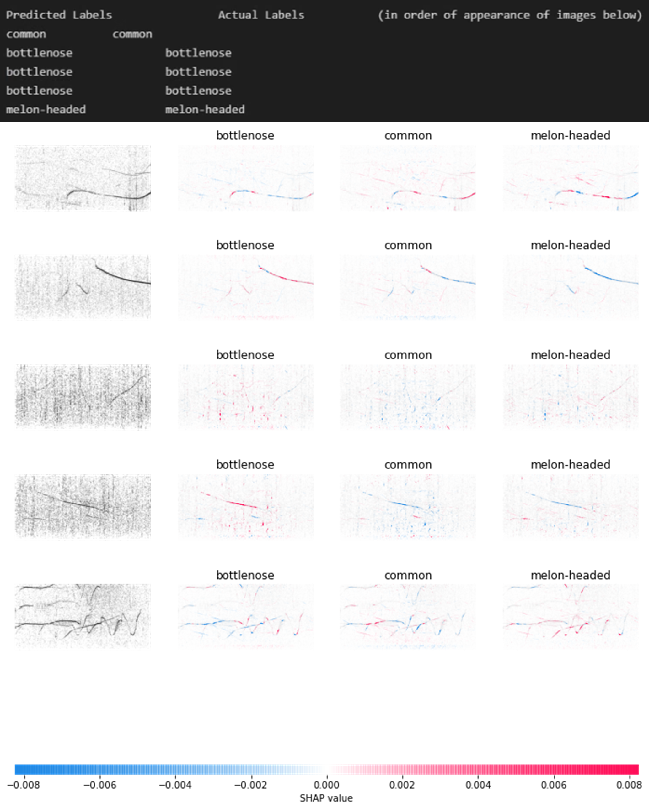
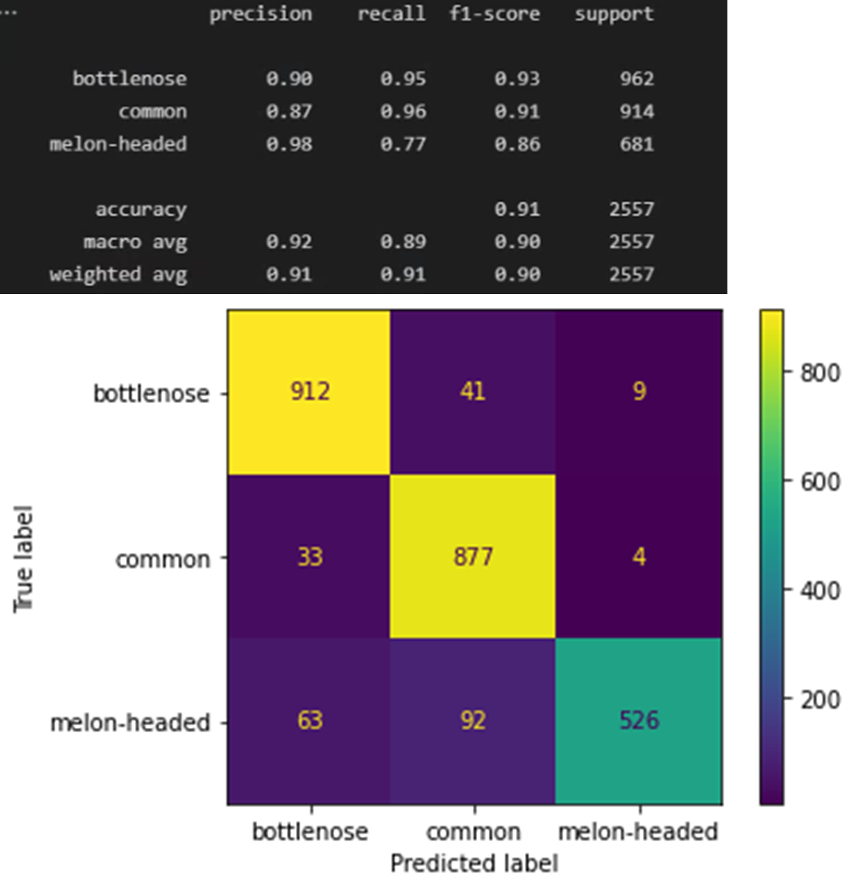

# CetaceXplain
This is a library meant to provide useful ways of visualizing and understanding the  manner in which machine learning models classify cetacean whistle contours. One of the most useful features of this package is that it uses the SHAP library (https://github.com/slundberg/shap) among others to
 highlight pixels of importance to machine learning models' decisions.
 
## Example of Use in Machine Learning Model Analysis
Here, we show a real example of how CetaceXplain was used for analysis. Below are two examples of the SHAP image explanations, with the terminal output above showing the corresponding predicted labels, and actual (correct) labels. This is some analysis taken from an assessment of the Xception architecture (see https://github.com/dolphin-acoustics-vip/Whistle_Classification/blob/main/Transfer_Learning_Xception.ipynb) when trained on dolphin whistle data. They were taken with a different number of background images over which SHAP values were calculated (SHAP needs some background images beforehand to do the explanations). Roughly speaking, the more the background images, the more comprehensive the pixel highlighting.

## Example 1

## Example 2

We see from the above that the model appears to do a reasonably good job at tracing whistle contours. This is likely due to the good pattern-finding capabilities of the Xception architecture as well as the normalization of the spectrograms. The model still has some flaws however. We can see, for example, that in the first row of Example 1,  the model is influenced partially by a bit of noise in the lower frequencies, indicated by the horizontal clustering of pixel highlights near the bottom of the spectrograms.

As shown below, we can also get more in-depth statistsics about the model using this module (which uses the help of the sci-kit-learn library: https://scikit-learn.org/stable/).

As indicated by the F1-scores, which are arguably a better metric than accuracy in this case, we see that the model does a fairly good job of detecting whistles from all species, but struggles the most with the melon-headed species. This is confirmed visually by the confusion matrix.
